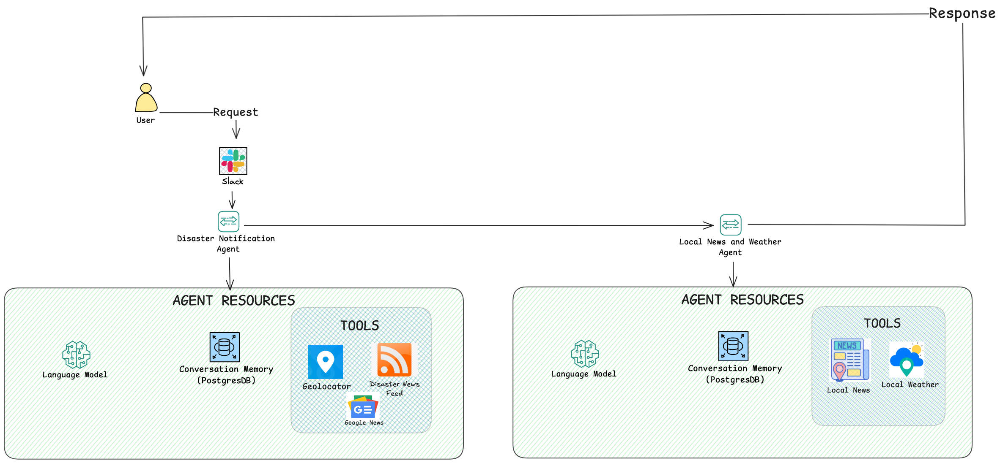

# Disaster Chat - Single Agent
### By Keith Baskerville 

## Disaster Response Slack Bot Trigger

### Description
Design and deploy a two-agent Slack bot that posts timely, local updates when mentioned in a designated channel:
- Agent 1 – Disaster News Agent: uses IP-based geolocation + FEMA RSS + Google News (7-day window) to produce a concise disaster summary.
- Agent 2 – Local News Agent: enriches with local headlines (GNews API) and current weather (OpenWeather), then posts a consolidated reply to Slack

### Objective

### Tools
- **Natural disaster RSS feed**  
- **FEMA**:  
  - [Major Disasters](https://www.fema.gov/feeds/disasters-major.rss)  
  - [Fire Disasters](https://www.fema.gov/feeds/disasters-fire.rss)  
- **Google News (last 7 days)**:  
  - [Natural Disasters - Past Week](https://news.google.com/rss/search?q=natural+disasters+when:7d)  
- **Geolocation Tool (via IP address)**  
  - Find IP: [WhatIsMyIPAddress](https://whatismyipaddress.com/)  

### Trigger

