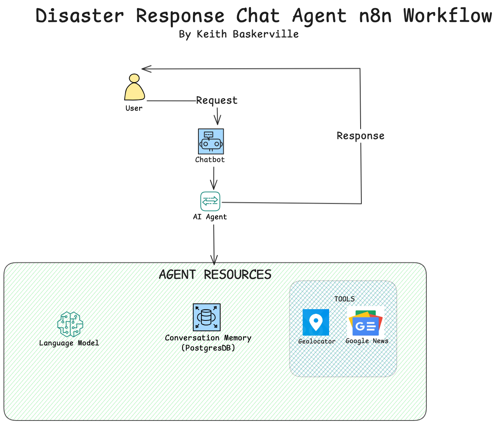

# Disaster Chat - Single Agent
### By Keith Baskerville 

## Disaster Response Chat Agent

### Description
Build a **single-agent AI workflow** that provides news summaries about local disasters in your area. The agent will have access to tools that provide context from Google News and FEMA, as well as your general location, to provide guidance.

### Objective
Build a **ReACT-based AI chat agent** that:

1. Takes a **user prompt** in a basic chat UI.  
2. Infers approximate location **via IP** (custom Geolocation tool).  
3. **Pulls recent disaster info** from FEMA Major/Fire RSS feeds and Google News (last 7 days).  
4. **Stores conversation memory** in a database.  
5. **Returns a step-by-step**, location-aware summary grounded in those sources.  

### Inputs
- Text prompt from a user via chat UI  
### Outputs
- A response to your query using information from the tools provided  
### Tools
- **Natural disaster RSS feed**  
- **FEMA**:  
  - [Major Disasters](https://www.fema.gov/feeds/disasters-major.rss)  
  - [Fire Disasters](https://www.fema.gov/feeds/disasters-fire.rss)  
- **Google News (last 7 days)**:  
  - [Natural Disasters - Past Week](https://news.google.com/rss/search?q=natural+disasters+when:7d)  
- **Geolocation Tool (via IP address)**  
  - Find IP: [WhatIsMyIPAddress](https://whatismyipaddress.com/)  

### Trigger
A basic chat interface to trigger the agent’s response.
